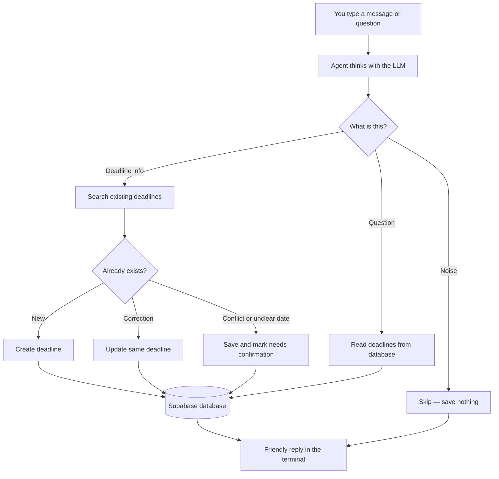

# How this works

A short product overview for reviewers. For setup, see the [README](README.md).

## What I built

A **CLI deadline agent** for students. You paste messy messages one at a time (class announcements, WhatsApp, email, syllabus snippets). The agent:

1. Extracts academic deadlines (what, course, due date, weightage)
2. Skips noise instead of inventing deadlines
3. **Updates** existing items on corrections (no duplicate rows)
4. Marks unknown or conflicting deadlines as needing confirmation and keeps both source messages
5. Answers questions like “what’s due this week?” from **Supabase Postgres**, not chat memory

Stack: **Node.js CLI · Groq (tool-calling LLM) · Supabase**

## Why this design

The hard part of the brief is data integrity, not a fancy UI:

- corrections must not create duplicates
- vague dates must not become guessed calendar days
- contradictions must not be silently resolved

So the system is a **single tool-calling agent** with a **write harness**:

- The model **chooses** which tools to call (`searchTasks`, `createTask`, `updateTask`, `flagConflict`, `listTasks`, …)
- Before any database write, harness checks can **refuse** or **downgrade** unsafe actions (e.g. inventing a date, creating without searching, overwriting on a rumour)

That keeps the agent autonomous while making the graded behaviours reliable.

## How a turn works



In short: **message in → LLM picks tools → safety checks on writes → Supabase → plain-text reply.**  
Type `s` anytime to see the original source messages for the last deadline.

## Data model (two tables)

| Table | Role |
|---|---|
| `tasks` | Current best view of one deadline (title, course, due date, weightage, status) |
| `task_sources` | Every raw message tied to that deadline (evidence: claimed date, claim type, channel) |

Contradictions are one `tasks` row with multiple `task_sources` rows that disagree — so both versions can be shown.

## What counts as a “task”

Anything dated a student can miss: assignments, quizzes, labs, project checkpoints, registration/form deadlines, etc. Pure social chatter is not stored.

## Testing

Fake messages live in [`data/test-messages.json`](data/test-messages.json) (~100 hand-written examples: noise, corrections, unknown dates, contradictions, questions). Run:

```bash
npm test
```

